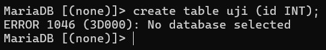
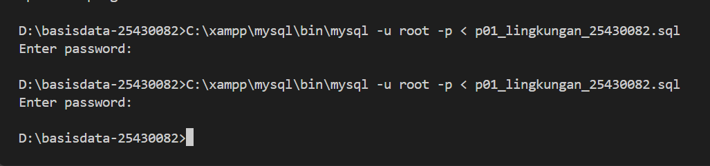
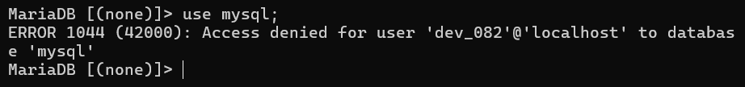

# Laporan Praktikum Basis Data - Pertemuan 01
**Nama:Chantika Regina B.P.**    **NIM:25430082**    **Kelas:C**    **Tanggal:10/03/26** 
## 1. Tujuan Praktikum

1. Menjalankan dan menghentikan layanan MariaDB melalui XAMPP Control Panel serta membaca status dan port-nya
2. Terhubung ke server MariaDB melalui klien baris perintah (CLI) dan phpMyAdmin, lalu menjelaskan perbedaan keduanya
3. Mengamankan akun root dengan password dan membuat akun kerja yang hak aksesnya terbatas pada satu basis data
4. Membuat basis data pertama dan mencatat pekerjaan ke repositori Git yang terhubung ke GitHub

## 2. Ringkasan Dasar Teori

Basis data adalah kumpulan data yang saling berhubungan dan disimpan secara terorganisasi agar dapat dipakai bersama oleh banyak pengguna dan aplikasi. Perangkat lunak yang mengelolanya disebut DBMS

## 3. Hasil Langkah Percobaan 

### D.1 Menjalankan MariaDB
![Menjalankan MariaDB] (img/d1_xampp.png)

### D.2 Masuk melalui klien
![Masuk melalui klien] (img/d2_shell.png)

### D.3 Update password
![Update password] (img/d3_password.png)

### D.4 Basis data dan akun kerja
![Akun kerja] (img/d4_akun_kerja.png)

### D.5 Menggunakan PHP
![PHP berhasil] (img/d5_phpmyadmin.png)

### Analisis 2
![Error 1045] (img/error_1045.png)

## 4. Jawaban Titik Analisis

**Analisis 1**
Hampir tidak ada konsekuensinya, karena pada dasarnya memang sama. Jadi jika mencari solusi sintaks eror menggunakan dokumentasi MySQL di internet masih sangat relevan. Kapan harus merujuk ke dokumentasi MariaDB? Ketika sedang menggunakan fitur baru atau yang khusus untuk MariaDB

**Analisis 2**
Sistem mendeteksi klien sedang mencoba untuk login tanpa memasukkan password

**Analisis 3**
Information_schema adalah database bawaan sistem yang hanya berisi informasi struktur, yang di mana setiap user mempunyai izin untuk mengaksesnya. Sedangkan mysql adalah database yang berisi data-data penting. Eror 1045 adalah gagal login yang disebabkan oleh typo dan kurang '-p'. Sedangkan eror 1044 adalah eror yang disebabkan oleh hak akses

**Analisis 4**
Karena mode cookie mengharuskan user untuk login manual dengan menggunakan password setiap kali ingin masuk. Sedangkan config, password dalam bentuk teks langsung di dalam file

## 5. Hasil Latihan dan Modifikasi

Galat muncul saat mencoba membuat tabel karena hak akses yang diberikan hanya sebatas 'SELECT', sehingga tidak diizinkan melakukan modifikasi struktur seperti perintah 'CREATE TABLE'

## 6. Tugas Mandiri: Milestone Proyek 01

## 7. Pembahasan dan Kendala
## 8. Kesimpulan
## 9. Pernyataan Penggunaan AI
## 10. Bukti Git                    
## Checklist      