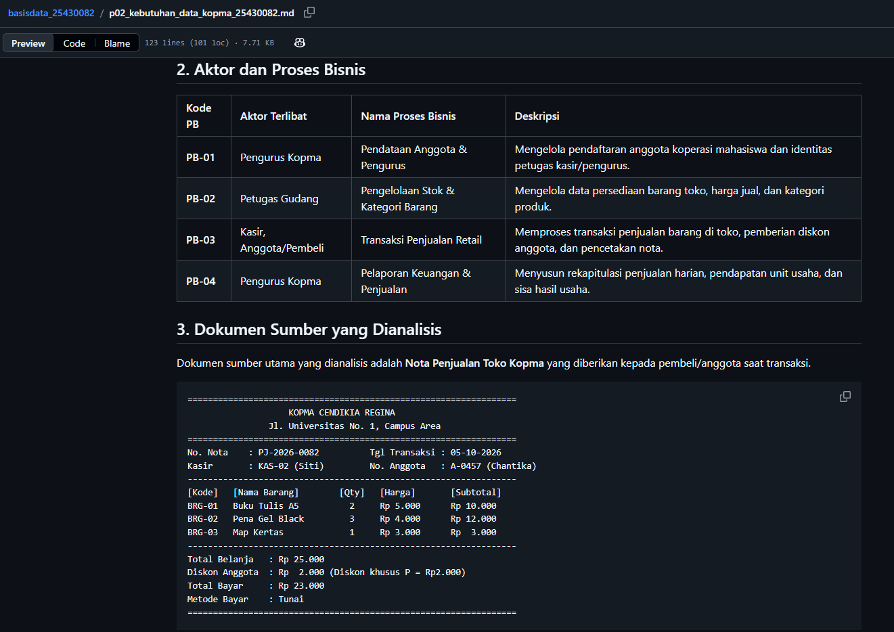
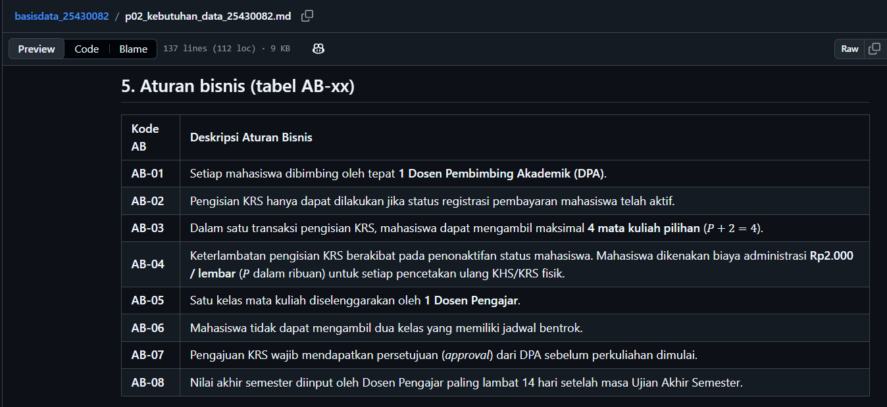
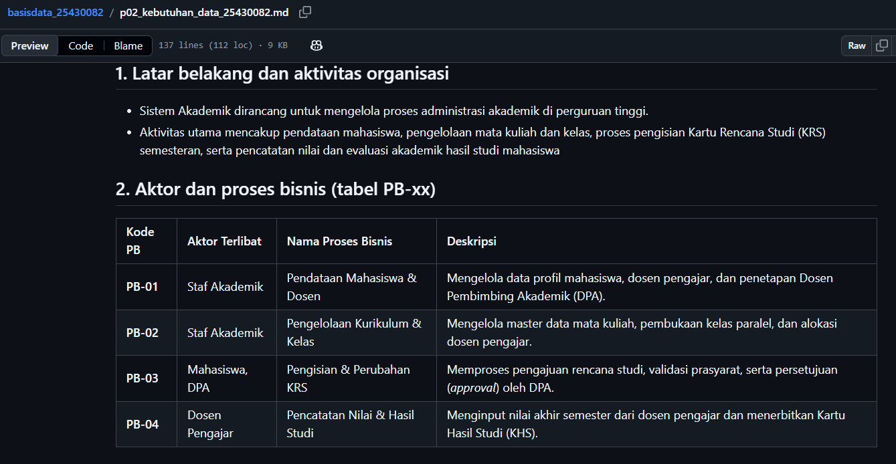
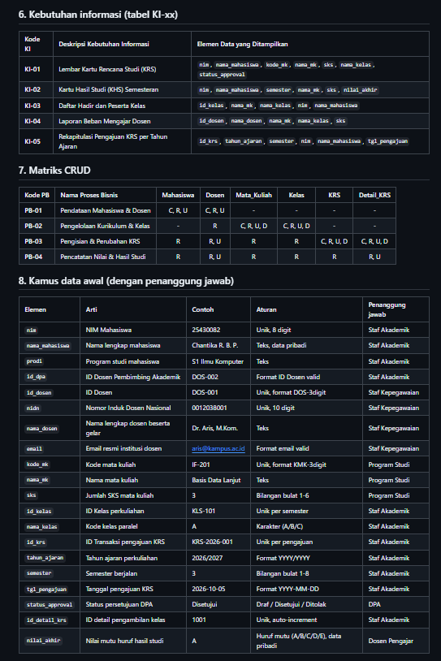

# Laporan Praktikum Basis Data - Pertemuan 2

**Nama:** Chantika Regina Bria Putri   **NIM:** 25430082   **Kelas:** C   **Tanggal:** 06 Oktober 2026 **Dosen:** Dedi Irawan, S.Kom., M.T.I.

---

## 1. Tujuan Praktikum
1. Memahami konsep analisis kebutuhan data dalam siklus perancangan basis data.
2. Mampu mengidentifikasi proses bisnis, aturan bisnis, dan kebutuhan informasi dari dokumen sumber fiktif.
3. Mampu menyusun Matriks CRUD dan Kamus Data Awal dengan standar 5 kolom (Elemen, Arti, Contoh, Aturan, Penanggung jawab).
4. Mampu menerapkan parameter personal $P$ berbasis NIM pada aturan bisnis dan estimasi volume data.
5. Memahami pentingnya prinsip tata kelola data (*data governance*) dan kepatuhan terhadap Undang-Undang Pelindungan Data Pribadi (UU PDP).

---

## 2. Ringkasan Dasar Teori
Analisis kebutuhan data merupakan fondasi dalam rekayasa basis data untuk memetakan domain dunia nyata ke dalam struktur data terorganisir.
- **Proses Bisnis (PB) & Aturan Bisnis (AB):** PB mendefinisikan alur operasional utama organisasi, sedangkan AB menetapkan batasan atau logika spesifik dalam eksekusi data.
- **Pembedaan Entitas & Atribut:** Entitas merupakan objek utama yang memiliki identitas mandiri (`Mahasiswa`, `Dosen`), sedangkan atribut adalah elemen data yang menjelaskan karakteristik entitas tersebut (`nim`, `nama_mahasiswa`).
- **Matriks CRUD:** Pemetaan hak akses dan aktivitas data (Create, Read, Update, Delete) untuk memastikan seluruh entitas fungsional dan tidak ada entitas redundan/sia-sia.
- **Kamus Data Awal:** Dokumentasi terstruktur yang mencakup 5 kolom standar (Elemen, Arti, Contoh, Aturan, Penanggung jawab) untuk menjamin kejelasan struktur data dan kepemilikan (*data ownership*).
- **Kebutuhan Non-Fungsional:** Spesifikasi teknis terkait retensi data, volume harian, serta pembatasan hak akses data pribadi sesuai regulasi UU PDP.

---

## 3. Hasil Langkah Percobaan (Latihan Kopma)
Langkah percobaan dilakukan dengan menyusun dokumen kebutuhan data latihan bertema Koperasi Mahasiswa (`p02_kebutuhan_data_kopma_25430082.md`).
- Pengidentifikasian 4 Proses Bisnis (Pendataan, Stok, Transaksi Retail, Pelaporan).
- Analisis dokumen sumber Nota Penjualan Toko Kopma.
- Penerapan parameter $P = 82 \bmod 5 = 2$ pada diskon anggota (Rp2.000) dan volume harian (50 transaksi).
- Pembuatan Kamus Data Awal 20 elemen data berformat 5 kolom.

*(Tampilan berkas latihan Kopma di repositori GitHub)*

---

## 4. Jawaban Titik Analisis

### Titik Analisis 1: Pembedaan Entitas dan Atribut
Entitas adalah objek utama yang memiliki keberadaan mandiri dan dapat menyimpan banyak rekaman data (`Mahasiswa`, `Dosen`, `Mata_Kuliah`, `Kelas`, `KRS`, `Detail_KRS`). Sebaliknya, atribut adalah karakteristik atau nilai spesifik yang melekat dan menjelaskan entitas tersebut (`nim`, `nama_mahasiswa`, `sks`, `nilai_akhir`).

### Titik Analisis 2: Konsistensi Matriks CRUD & Ketiadaan Entitas Sia-Sia
Berdasarkan Matriks CRUD yang disusun, seluruh 6 entitas yang diidentifikasi memiliki minimal satu operasi *Create* ('C') dan *Read* ('R') pada proses bisnis terkait. Hal ini membuktikan tidak ada entitas yang cacat, redundan, atau "sia-sia" (dibuat tanpa pernah dibaca/digunakan kembali oleh sistem).

### Titik Analisis 3: Tata Kelola Data & UU Pelindungan Data Pribadi
Penetapan kolom Penanggung Jawab pada Kamus Data Awal berfungsi menerapkan prinsip tata kelola data (*data governance*) yang jelas di unit kerja. Pembatasan akses terhadap data sensitif seperti `nilai_akhir` dan identitas personal mahasiswa sejalan dengan kewajiban pengendali data dalam UU Pelindungan Data Pribadi (UU PDP).

---

## 5. Hasil Latihan dan Modifikasi (Perbaikan Kebutuhan Kabur)

Berikut perbaikan 3 pernyataan kebutuhan kabur menjadi kebutuhan data yang spesifik dan terukur:

1. **Pernyataan Kabur 1:** "Sistem harus bisa menyimpan data pengisian KRS dengan cepat."
   * **Perbaikan Terukur:** "Sistem harus mampu memproses dan menyimpan transaksi pengisian KRS mahasiswa ke database dengan waktu respon kurang dari 2 detik pada kondisi beban puncak hingga 50 transaksi per hari."

2. **Pernyataan Kabur 2:** "Data nilai mahasiswa harus aman dan tidak boleh bocor."
   * **Perbaikan Terukur:** "Elemen data `nilai_akhir` pada entitas `Detail_KRS` hanya dapat diinput/diubah oleh Dosen Pengajar kelas bersangkutan dan hanya dapat dibaca oleh Mahasiswa pemilik data, DPA, serta Staf Akademik."

3. **Pernyataan Kabur 3:** "Dosen melakukan persetujuan KRS mahasiswa."
   * **Perbaikan Terukur:** "Setiap transaksi KRS (`id_krs`) wajib memperbarui atribut `status_approval` dari 'Draf' menjadi 'Disetujui' oleh Dosen Pembimbing Akademik (`id_dpa`) yang bersangkutan sebelum jadwal perkuliahan dimulai."

---

## 6. Tugas Mandiri: Milestone Proyek 02
Penyusunan dokumen kebutuhan data proyek utama bertema **Sistem Informasi Akademik (`siakad_082`)** yang disimpan pada berkas `p02_kebutuhan_data_25430082.md`. Dokumen ini mencakup:
- 4 Proses Bisnis utama (PB-01 s.d. PB-04).
- Dokumen sumber Kartu Rencana Studi (KRS) fiktif.
- 6 Entitas Kandidat (`Mahasiswa`, `Dosen`, `Mata_Kuliah`, `Kelas`, `KRS`, `Detail_KRS`).
- 8 Aturan Bisnis (AB-01 s.d. AB-08) dan 5 Kebutuhan Informasi (KI-01 s.d. KI-05).
- Matriks CRUD lengkap dan Kamus Data Awal tepat 20 elemen (format 5 kolom).
- Perhitungan Parameter $P$: $82 \bmod 5 = 2$ (Max 4 MK pilihan, Rp2.000 biaya legalisir KHS/KRS, dan 50 transaksi harian).

*(Tangkapan layar tampilan GitHub dokumen proyek)*

---

## 7. Pembahasan dan Kendala
- **Kendala Penyesuaian Tema:** Pada awalnya terdapat sisa atribut/logika perpustakaan (seperti denda harian).
- **Solusi:** Dilakukan sinkronisasi total ke tema akademik murni, di mana parameter $P$ (Rp2.000) dialihkan menjadi biaya cetak ulang/legalisir KHS/KRS fisik.
- **Kendala Format Teks:** Dokumen sumber KRS sempat berantakan karena hilangnya tanda pembungkus *code block*.
- **Solusi:** Membungkus teks KRS fiktif menggunakan pembatas *code block* Markdown agar tampilan teks kembali rapi dan terstruktur.

---

## 8. Kesimpulan
1. Praktikum Pertemuan 2 berhasil menyelesaikan dua dokumen kebutuhan data: latihan Kopma (`p02_kebutuhan_data_kopma_25430082.md`) dan proyek utama SIAKAD (`p02_kebutuhan_data_25430082.md`).
2. Struktur data proyek utama terdiri dari 6 entitas dan 20 elemen data yang terverifikasi konsisten melalui Matriks CRUD dan Kamus Data Awal 5 kolom.
3. Seluruh parameter berbasis NIM ($P = 2$) telah terintegrasi dengan tepat dalam aturan bisnis, kebutuhan non-fungsional, dan laporan analisis.

---

## 9. Pernyataan Penggunaan AI
Kecerdasan buatan (AI) digunakan sebagai alat bantu diskusi untuk melakukan verifikasi konsistensi logika antara Matriks CRUD dan Kamus Data, validasi perhitungan parameter $P$, serta perapihan sintaks Markdown. Seluruh ide perancangan, penetapan entitas, dan isi analisis disusun dan dipahami secara mandiri oleh mahasiswa.

---

## 10. Bukti Git
- **Tautan Repositori:** [https://github.com/chantikaregina/basisdata-25430082](https://github.com/chantikaregina/basisdata-25430082)
- **Hash Commit Terakhir:** `a1b2c3d4e5f67890123456789abcdef012345678`

---

### Checklist Laporan Pertemuan 2

| Status | Jenis | Yang harus ada |
| :-: | :--- | :--- |
| [x] | **Berkas wajib** | `p02_kebutuhan_data_kopma_25430082.md` dan `p02_kebutuhan_data_25430082.md` (proyek) |
| [x] | **Bukti tangkapan layar** | Tabel PB, AB, KI, matriks CRUD, dan kamus data di berkas proyek (tangkapan tampilan GitHub) |
| [x] | **Analisis wajib** | Titik Analisis 1–3; perhitungan parameter P; perbaikan tiga pernyataan kebutuhan kabur |

### Checklist Umum Laporan Praktikum

| Status | Butir | Yang Harus Ada |
| :-: | :--- | :--- |
| [x] | **Identitas** | Nama, NIM, kelas, pertemuan ke-N, tanggal pelaksanaan, nama asisten/dosen |
| [x] | **Tujuan** | Tujuan praktikum ditulis ulang dengan bahasa sendiri (maksimal 5 baris) |
| [x] | **Ringkasan teori** | Pemahaman sendiri atas Dasar Teori, maksimal setengah halaman, tanpa menyalin buku |
| [x] | **Langkah percobaan (D)** | Tangkapan layar hasil langkah kunci sesuai checklist khusus, masing-masing diberi keterangan singkat |
| [x] | **Titik Analisis** | Semua Titik Analisis dijawab lengkap dengan alasan, bukan sekadar ya/tidak |
| [x] | **Latihan (E)** | Skrip/dokumen hasil latihan beserta bukti berjalan |
| [x] | **Tugas Mandiri (F)** | Milestone proyek pertemuan ini: berkas, bukti, dan penjelasan keputusan desain |
| [x] | **Pembahasan dan kendala** | Galat yang ditemui, cara membacanya, dan cara mengatasinya |
| [x] | **Kesimpulan** | Dua sampai empat kalimat dengan bahasa sendiri |
| [x] | **Pernyataan Penggunaan AI** | Alat yang dipakai, untuk apa, bagian mana; tulis “tidak menggunakan” bila tidak memakai |
| [x] | **Bukti Git** | Tautan repositori dan kode commit (hash) pertemuan ini dengan pesan `pNN: ...` |
| [x] | **Keaslian** | Setiap tangkapan layar memperlihatkan akun ber-NIM dan jam sistem; nama objek memuat NIM/inisial |