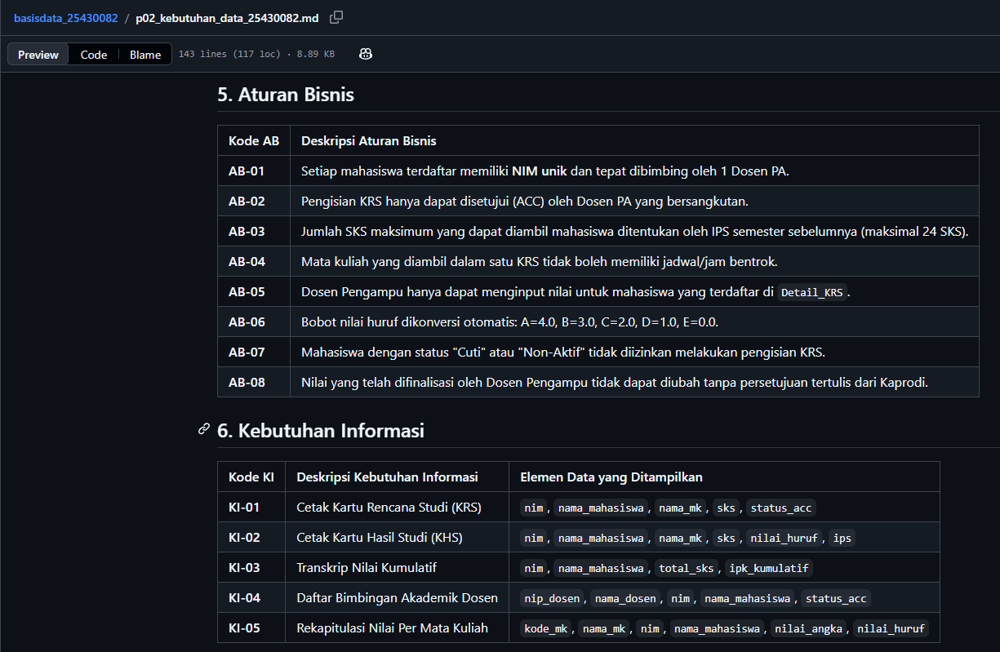
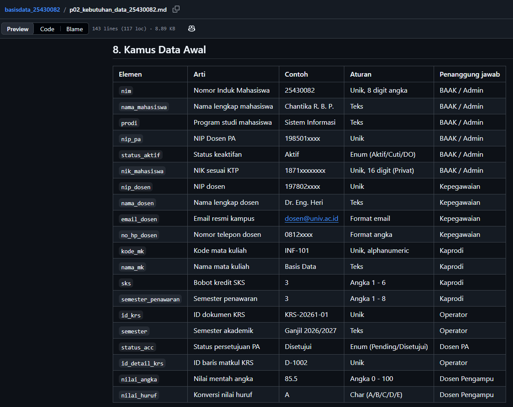
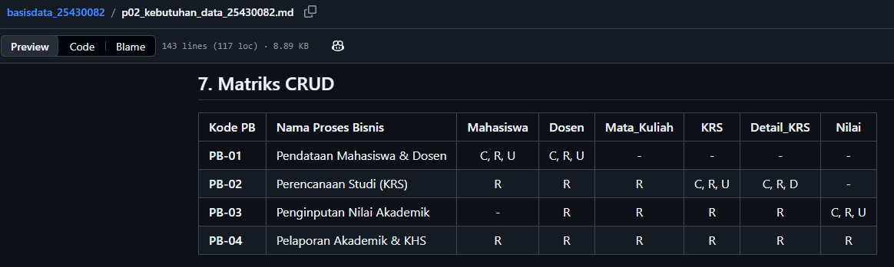
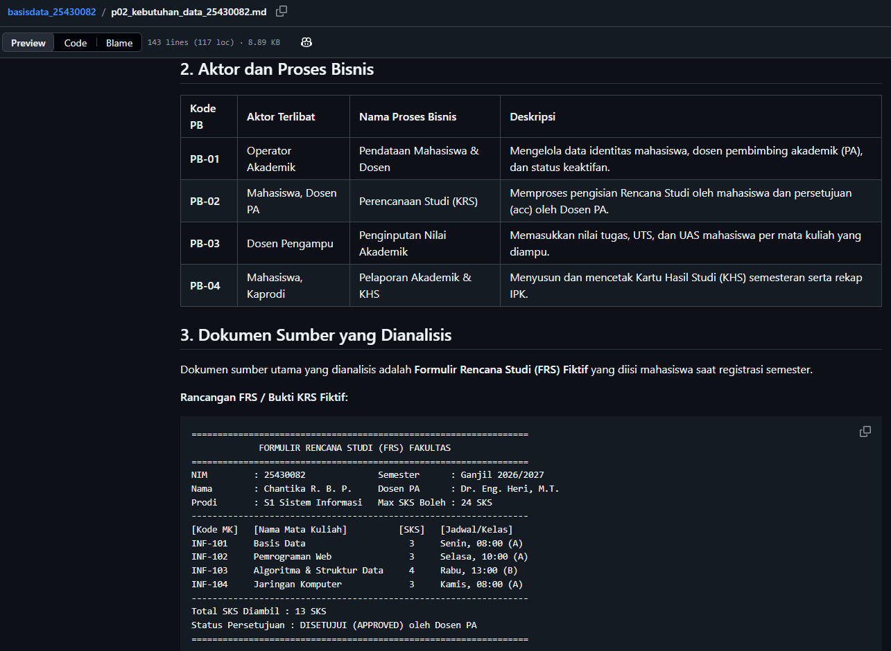

# Laporan Praktikum Basis Data - Pertemuan 2

* **Nama:** Chantika Regina Bria Putri   
* **NIM:** 25430082   
* **Kelas:** C   
* **Tanggal:** 06 Oktober 2026 
* **Dosen:** Dedi Irawan, S.Kom., M.T.I.

---

## 1. Tujuan Praktikum
1. Memahami konsep analisis kebutuhan data dalam siklus perancangan basis data.
2. Mampu mengidentifikasi proses bisnis, aturan bisnis, dan kebutuhan informasi dari dokumen sumber fiktif.
3. Mampu menyusun Matriks CRUD dan Kamus Data Awal dengan standar 5 kolom (Elemen, Arti, Contoh, Aturan, Penanggung jawab).
4. Mampu menerapkan parameter personal $P$ berbasis NIM pada aturan bisnis dan estimasi volume data.
5. Memahami pentingnya prinsip tata kelola data (*data governance*) dan kepatuhan terhadap Undang-Undang Pelindungan Data Pribadi (UU PDP).

---

## 2. Ringkasan Dasar Teori
Analisis kebutuhan data merupakan fondasi dalam rekayasa basis data untuk memetakan domain dunia nyata ke dalam struktur data terorganisir.
- **Proses Bisnis (PB) & Aturan Bisnis (AB):** PB mendefinisikan alur operasional utama organisasi, sedangkan AB menetapkan batasan atau logika spesifik dalam eksekusi data.
- **Pembedaan Entitas & Atribut:** Entitas merupakan objek utama yang memiliki identitas mandiri (`Mahasiswa`, `Dosen`), sedangkan atribut adalah elemen data yang menjelaskan karakteristik entitas tersebut (`nim`, `nama_mahasiswa`).
- **Matriks CRUD:** Pemetaan hak akses dan aktivitas data (Create, Read, Update, Delete) untuk memastikan seluruh entitas fungsional dan tidak ada entitas redundan/sia-sia.
- **Kamus Data Awal:** Dokumentasi terstruktur yang mencakup 5 kolom standar (Elemen, Arti, Contoh, Aturan, Penanggung jawab) untuk menjamin kejelasan struktur data dan kepemilikan (*data ownership*).
- **Kebutuhan Non-Fungsional:** Spesifikasi teknis terkait retensi data, volume harian, serta pembatasan hak akses data pribadi sesuai regulasi UU PDP.

---

## 3. Hasil Langkah Percobaan (Latihan Kopma)
Langkah percobaan dilakukan dengan menyusun dokumen kebutuhan data latihan bertema Koperasi Mahasiswa (`p02_kebutuhan_data_kopma_25430082.md`).
- Pengidentifikasian 4 Proses Bisnis (Pendataan, Stok, Transaksi Retail, Pelaporan).
- Analisis dokumen sumber Nota Penjualan Toko Kopma.
- Penerapan parameter $P = 82 \bmod 5 = 2$ pada diskon anggota (Rp2.000) dan volume harian (50 transaksi).
- Pembuatan Kamus Data Awal 20 elemen data berformat 5 kolom.

*(Tampilan berkas latihan Kopma di repositori GitHub)*

---

## 4. Jawaban Titik Analisis

### Titik Analisis 1
Harga barang di toko itu sifatnya dinamis dan bisa naik-turun kapan saja (misalnya ada kenaikan harga dari pemasok). Kalau nota cuma mengambil data harga dari tabel master barang tanpa menyimpan harga pada saat transaksi terjadi, laporan penjualan masa lalu bakal berantakan begitu ada perubahan harga. Contohnya, barang yang bulan lalu dijual Rp4.000 tiba-tiba bulan ini naik jadi Rp5.000. Kalau harga tidak dikunci di nota, rekap penjualan bulan lalu bakal ikut berubah seolah-olah dulu dijual Rp5.000. Masalah inilah yang bikin laporan pendapatan historis ketua koperasi jadi ngaco/salah hitung. Makanya, `harga_saat_transaksi` wajib disimpan tersendiri di nota.

### Titik Analisis 2
* **Alasan TIDAK menyimpan nilai turunan (Subtotal & Total):**
  Untuk mencegah pemborosan ruang simpan (*redundancy*) dan risiko ketidakcocokan data (*data anomaly*). Nilai subtotal dan total itu hasil hitungan matematis biasa (`jumlah x harga`), jadi sebenarnya bisa dihitung langsung lewat kueri saat laporan dibuka tanpa perlu disimpan permanen.

* **Alasan TETAP menyimpan nilai turunan:**
  Demi kecepatan dan performa kueri sistem. Kalau transaksi sudah menumpuk sampai ribuan baris, menghitung ulang total dari tabel detail satu per satu setiap kali membuka rekap harian bakal bikin database terasa berat dan lambat. Menyimpan angka total langsung di tabel nota bikin penarikan laporan jauh lebih cepat.

### Titik Analisis 3
* **Arti kolom Pemasok tanpa huruf 'C' (Create):**
  Ini menandakan ada alur sistem yang tidak logis (*data gap*). Data pemasok ingin dibaca atau dipakai, tapi tidak ada satu pun proses bisnis yang bertugas menginput data pemasok tersebut ke dalam database.
  
* **Proses bisnis yang perlu ditambahkan:**
  Perlu ditambah satu proses bisnis baru, yaitu **"Pengelolaan Data Pemasok & Pengadaan"** yang memegang akses CRUD penuh untuk entitas Pemasok.
  
* **Aktor yang mengubah status aktif anggota:**
  **Pengurus Kopma** (divisi keanggotaan/sekretaris) melalui proses bisnis **Pendataan Anggota & Pengurus**.

---

## 5. Hasil Latihan dan Modifikasi (Perbaikan Kebutuhan Kabur)

### 1. Penambahan Fitur Poin Loyalitas Kopma
* **Elemen Data Tambahan:**
  * `total_poin` (pada entitas `Anggota`)
  * `poin_diperoleh`, `poin_ditukar` (pada entitas `Penjualan`)
* **Aturan Bisnis Tambahan:**
  * **AB-07:** Setiap kelipatan belanja Rp10.000 dalam satu nota, anggota aktif otomatis mendapatkan 1 poin loyalitas.
  * **AB-08:** Anggota yang memiliki minimal 50 poin loyalitas dapat menukarkan poin tersebut dengan potongan harga sebesar Rp5.000 pada transaksi berikutnya.
* **Kebutuhan Informasi Tambahan:**
  * **KI-05 (Laporan Poin Loyalitas Anggota):** Menampilkan `no_anggota`, `nama_anggota`, `total_poin`, dan riwayat penukaran poin.
* **Pembaruan Matriks CRUD:**
  * Proses **Transaksi Penjualan Retail (PB-03)** menambah akses **U (Update)** pada entitas `Anggota` untuk memperbarui `total_poin` secara otomatis setiap selesai transaksi atau penukaran.

### 2. Perbaikan Pernyataan Kebutuhan Kabur
Berikut adalah revisi kebutuhan non-fungsional agar terukur dan dapat diuji (*measurable/testable*):

* **(a) "Data anggota harus aman"**
  * **Revisi:** Akses data nomor HP dan identitas pribadi anggota dibatasi hanya untuk Pengurus Utama, serta seluruh kata sandi akun wajib dienkripsi menggunakan algoritma hashing bcrypt.
* **(b) "Sistem harus cepat mencari barang"**
  * **Revisi:** Pencarian data barang berdasarkan kode atau nama barang harus menampilkan hasil di layar dalam waktu maksimal 2 detik pada kondisi beban kerja normal.
* **(c) "Laporan stok harus akurat"**
  * **Revisi:** Sistem wajib memperbarui jumlah stok barang secara *real-time* saat transaksi berhasil disimpan, sehingga selisih antara stok di sistem dan stok fisik gudang adalah 0%.

---

## 6. Tugas Mandiri: Milestone Proyek 02
Penyusunan dokumen kebutuhan data proyek utama bertema **Sistem Informasi Akademik (`siakad_082`)** yang disimpan pada berkas `p02_kebutuhan_data_25430082.md`. Dokumen ini mencakup:
- 4 Proses Bisnis utama (PB-01 s.d. PB-04).
- Dokumen sumber Kartu Rencana Studi (KRS) fiktif.
- 6 Entitas Kandidat (`Mahasiswa`, `Dosen`, `Mata_Kuliah`, `Kelas`, `KRS`, `Detail_KRS`).
- 8 Aturan Bisnis (AB-01 s.d. AB-08) dan 5 Kebutuhan Informasi (KI-01 s.d. KI-05).
- Matriks CRUD lengkap dan Kamus Data Awal tepat 20 elemen (format 5 kolom).
- Perhitungan Parameter $P$: $82 \bmod 5 = 2$ (Max 4 MK pilihan, Rp2.000 biaya legalisir KHS/KRS, dan 50 transaksi harian).

*(Tangkapan layar tampilan GitHub dokumen proyek)*

---

## 7. Pembahasan dan Kendala
- **Kendala Penyesuaian Tema:** Pada awalnya terdapat sisa atribut/logika perpustakaan (seperti denda harian).
- **Solusi:** Dilakukan sinkronisasi total ke tema akademik murni, di mana parameter $P$ (Rp2.000) dialihkan menjadi biaya cetak ulang/legalisir KHS/KRS fisik.
- **Kendala Format Teks:** Dokumen sumber KRS sempat berantakan karena hilangnya tanda pembungkus *code block*.
- **Solusi:** Membungkus teks KRS fiktif menggunakan pembatas *code block* Markdown agar tampilan teks kembali rapi dan terstruktur.

---

## 8. Kesimpulan
1. Praktikum Pertemuan 2 berhasil menyelesaikan dua dokumen kebutuhan data: latihan Kopma (`p02_kebutuhan_data_kopma_25430082.md`) dan proyek utama SIAKAD (`p02_kebutuhan_data_25430082.md`).
2. Struktur data proyek utama terdiri dari 6 entitas dan 20 elemen data yang terverifikasi konsisten melalui Matriks CRUD dan Kamus Data Awal 5 kolom.
3. Seluruh parameter berbasis NIM ($P = 2$) telah terintegrasi dengan tepat dalam aturan bisnis, kebutuhan non-fungsional, dan laporan analisis.

---

## 9. Pernyataan Penggunaan AI
Kecerdasan buatan (AI) digunakan sebagai alat bantu diskusi untuk melakukan verifikasi konsistensi logika antara Matriks CRUD dan Kamus Data, validasi perhitungan parameter $P$, serta perapihan sintaks Markdown. Seluruh ide perancangan, penetapan entitas, dan isi analisis disusun dan dipahami secara mandiri oleh mahasiswa.

---

## 10. Bukti Git
- **Tautan Repositori:** [basisdata-25430082](https://github.com/chantikaregina/basisdata-25430082)
- **Hash Commit Terakhir:** `a1b2c3d4e5f67890123456789abcdef012345678`

---

### Checklist Khusus Pertemuan 2

| Status | Jenis | Yang harus ada |
| :-: | :--- | :--- |
| [x] | **Berkas wajib** | `p02_kebutuhan_data_kopma_25430082.md` dan `p02_kebutuhan_data_25430082.md` (proyek) |
| [x] | **Bukti tangkapan layar** | Tabel PB, AB, KI, matriks CRUD, dan kamus data di berkas proyek (tangkapan tampilan GitHub) |
| [x] | **Analisis wajib** | Titik Analisis 1–3; perhitungan parameter P; perbaikan tiga pernyataan kebutuhan kabur |

### Checklist Umum Setiap Laporan Pertemuan

| Status | Butir | Yang Harus Ada |
| :-: | :--- | :--- |
| [x] | **Identitas** | Nama, NIM, kelas, pertemuan ke-N, tanggal pelaksanaan, nama asisten/dosen |
| [x] | **Tujuan** | Tujuan praktikum ditulis ulang dengan bahasa sendiri (maksimal 5 baris) |
| [x] | **Ringkasan teori** | Pemahaman sendiri atas Dasar Teori, maksimal setengah halaman, tanpa menyalin buku |
| [x] | **Langkah percobaan (D)** | Tangkapan layar hasil langkah kunci sesuai checklist khusus, masing-masing diberi keterangan singkat |
| [x] | **Titik Analisis** | Semua Titik Analisis dijawab lengkap dengan alasan, bukan sekadar ya/tidak |
| [x] | **Latihan (E)** | Skrip/dokumen hasil latihan beserta bukti berjalan |
| [x] | **Tugas Mandiri (F)** | Milestone proyek pertemuan ini: berkas, bukti, dan penjelasan keputusan desain |
| [x] | **Pembahasan dan kendala** | Galat yang ditemui, cara membacanya, dan cara mengatasinya |
| [x] | **Kesimpulan** | Dua sampai empat kalimat dengan bahasa sendiri |
| [x] | **Pernyataan Penggunaan AI** | Alat yang dipakai, untuk apa, bagian mana; tulis “tidak menggunakan” bila tidak memakai |
| [x] | **Bukti Git** | Tautan repositori dan kode commit (hash) pertemuan ini dengan pesan `pNN: ...` |
| [x] | **Keaslian** | Setiap tangkapan layar memperlihatkan akun ber-NIM dan jam sistem; nama objek memuat NIM/inisial |