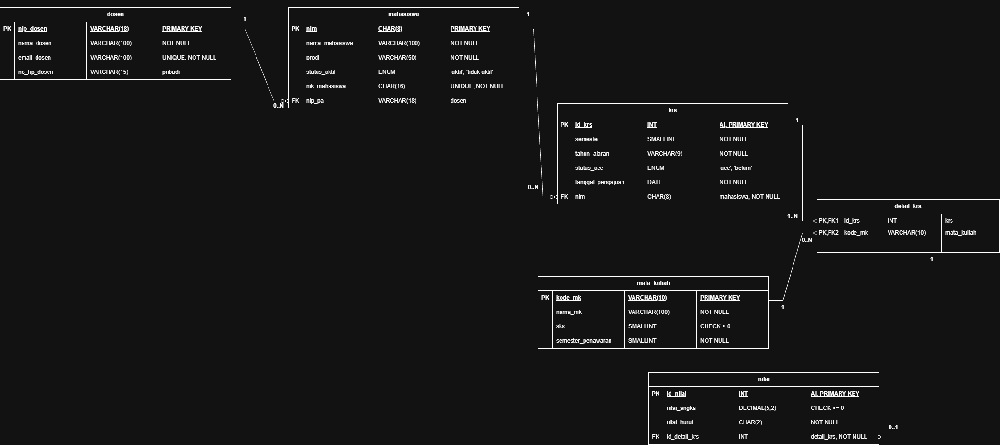

# Laporan Praktikum Basis Data - Pertemuan 03

- **Nama:** Chantika Regina Bria Putri  
- **NIM:** 25430082  
- **Kelas:** C 
- **Tanggal:** 10 Oktober 2026
- **Dosen:** Dedi Irawan, S.Kom., M.T.I.

## 1. Tujuan Praktikum
1. Mengidentifikasi entitas, atribut, dan kunci utama dari dokumen kebutuhan data proyek akademik.
2. Menentukan relasi serta kardinalitas antartabel pakai notasi Crow's Foot sesuai aturan bisnis akademik.
3. Memecah relasi many-to-many biar dapat entitas asosiatif yang pas.
4. Bikin gambar ERD konseptual terus mencocokkan jalurnya sama Kebutuhan Informasi (KI).

## 2. Ringkasan Dasar Teori
ERD itu ibarat denah atau rancangan awal buat menggambarkan gimana data saling terhubung sebelum kita bikin tabel aslinya di database. Pakai notasi Crow's Foot, kita bisa tahu jumlah relasi antartabel (kardinalitasnya). Simbol cakar ayam (`<`) artinya banyak (*many*), garis lurus (`|`) artinya satu (*one*), dan bulatan (`o`) artinya opsional atau nol. Kalau ada relasi banyak-ke-banyak (N:N) seperti hubungan antara mahasiswa dan mata kuliah, kita tidak bisa langsung hubungkan dua tabel itu gitu saja, jadi harus dipisah pakai tabel tengah atau entitas asosiatif seperti KRS dan detail KRS.

## 3. Hasil Langkah Percobaan
 
- **Keterangan:** Hasil rancangan ERD konseptual sistem Akademik keseluruhan yang mencakup entitas master dan entitas transaksional.

## 4. Jawaban Titik Analisis
- **Titik Analisis 1:** Kita memilih memakai `id_*` (kunci buatan/surrogate key) dibanding NIM atau kode alami biar kalau misal ada perubahan format NIM/NIP di masa depan, relasi antartabel tidak bakal berantakan.
- **Titik Analisis 2:** Ujung relasi dari tabel `krs` ke `detail_krs` nilainya wajib satu atau banyak (*mandatory many* / 1..N). Soalnya tidak mungkin ada dokumen KRS kalau tidak ada mata kuliah yang diambil sama sekali.
- **Titik Analisis 3:** Perlu menambahkan relasi dan entitas pendukung seperti `detail_krs` dan `nilai` untuk memastikan seluruh rekam jejak akademis mahasiswa (dari pengisian KRS sampai input nilai per semester) tercatat presisi.

## 5. Hasil Latihan dan Modifikasi
  
- **Keterangan:** Penyesuaian tata letak garis penghubung dan posisi entitas asosiatif agar simbol kardinalitas Crow's Foot terbaca dengan jelas tanpa tumpang tindih.

## 6. Tugas Mandiri: Milestone Proyek 3
### A. Tabel Relasi dan Kardinalitas Proyek Akademik
| Relasi | Sisi Kiri | Sisi Kanan | Dasar Aturan Bisnis |
| :--- | :--- | :--- | :--- |
| `dosen` $\rightarrow$ `mahasiswa` (Perwalian) | Tepat satu dosen (1) | Nol atau banyak mahasiswa (0..N) | Setiap mahasiswa memiliki satu Dosen PA. |
| `mahasiswa` $\rightarrow$ `krs` | Tepat satu mahasiswa (1) | Nol atau banyak KRS (0..N) | Mahasiswa dapat mengambil KRS setiap semester. |
| `krs` $\rightarrow$ `detail_krs` | Tepat satu KRS (1) | Satu atau banyak detail (1..N) | Dokumen KRS wajib memuat minimal satu mata kuliah. |
| `mata_kuliah` $\rightarrow$ `detail_krs` | Tepat satu mata kuliah (1) | Nol atau banyak detail (0..N) | Mata kuliah dapat diambil oleh banyak mahasiswa dalam detail KRS. |
| `detail_krs` $\rightarrow$ `nilai` | Tepat satu detail KRS (1) | Nol atau satu nilai (0..1) | Setiap pengambilan mata kuliah menghasilkan satu komponen nilai akhir. |

### B. Penelusuran Jalur Kebutuhan Informasi (KI)
- **KI-01 (Rekap KRS Mahasiswa per Semester):** Jalurnya lewat `mahasiswa` $\rightarrow$ `krs` $\rightarrow$ `detail_krs` $\rightarrow$ `mata_kuliah`.
- **KI-02 (Transkrip Nilai Akademik):** Jalurnya lewat `mahasiswa` $\rightarrow$ `krs` $\rightarrow$ `detail_krs` $\rightarrow$ `nilai` $\rightarrow$ `mata_kuliah`.
- **KI-03 (Daftar Mahasiswa Bimbingan Per Dosen PA):** Jalurnya langsung dari `dosen` $\rightarrow$ `mahasiswa`.
- **KI-04 (Mata Kuliah dengan Peminat Terbanyak):** Jalurnya lewat `mata_kuliah` $\rightarrow$ `detail_krs`.

### C. Catatan Tinjauan Klien
1. **Masukan dari teman (Klien 1):** "Coba perhatikan relasi antara tabel `krs` dan `detail_krs`, pastikan atribut SKS atau kelas tercatat dengan jelas pada entitas yang tepat."
   - **Keputusan:** Diterima. Atribut terkait kelas dan semester dicatat di tingkat KRS, sedangkan rincian nilai diletakkan pada entitas `nilai`.
2. **Masukan dari teman (Klien 2):** "Pastikan status keaktifan mahasiswa diakomodasi dalam atribut entitas `mahasiswa`."
   - **Keputusan:** Diterima. Atribut `status_mahasiswa` ditambahkan ke dalam rancangan entitas `mahasiswa`.

## 7. Pembahasan dan Kendala
Kendala utama pas menyusun ERD di `draw.io` itu mengatur posisi garis penghubung antar entitas biar tidak saling menumpuk, soalnya kalau garisnya berantakan, simbol kardinalitas *Crow's Foot* jadi susah dibaca sama klien. Masalah ini diatasi dengan mengatur ulang tata letak (*layout*) kotak tabel secara modular berdasarkan kelompok master dan transaksi.

## 8. Kesimpulan
Rancangan ERD konseptual buat proyek Akademik sudah selesai dibuat di draw.io memakai notasi *Crow's Foot*. Semua alurnya sudah divalidasi dan selaras sama Kebutuhan Informasi (KI).

## 9. Pernyataan Penggunaan AI
Pakai AI cuma buat bantu diskusi pemahaman materi kardinalitas *Crow's Foot*, format tabel penelusuran jalur KI, sama merapikan kerangka format laporan.

## 10. Bukti Git
- **Tautan Repositori:** [basisdata-25430082](https://github.com/chantikaregina/basisdata_25430082)
- **Hash Commit:** `13d85bf`

## Checklist Umum Setiap Laporan Pertemuan
- [x] **Identitas:** Nama, NIM, kelas, pertemuan ke-3, tanggal pelaksanaan, nama dosen pengampu tercantum lengkap.
- [x] **Tujuan:** Tujuan praktikum ditulis ulang dengan bahasa sendiri secara ringkas dan padat.
- [x] **Ringkasan Teori:** Pemahaman mandiri atas dasar teori konsep ERD dan notasi *Crow's Foot*.
- [x] **Langkah Percobaan (D):** Tangkapan layar hasil langkah percobaan ERD dengan keterangan singkat.
- [x] **Titik Analisis:** Semua Titik Analisis (1-3) dijawab lengkap dengan alasan logis, bukan sekadar ya/tidak.
- [x] **Latihan (E):** Berkas hasil latihan/modifikasi tata letak diagram ERD beserta buktinya.
- [x] **Tugas Mandiri (F):** Milestone Proyek 3 (berkas `.drawio`, gambar `.png`, tabel relasi, jalur KI, dan catatan tinjauan klien).
- [x] **Pembahasan dan Kendala:** Kendala penataan garis ERD dan solusinya dicatat dengan jelas.
- [x] **Kesimpulan:** Kesimpulan ditulis dalam beberapa kalimat dengan bahasa sendiri.
- [x] **Pernyataan Penggunaan AI:** Alat yang dipakai, untuk apa, dan bagian mana dijelaskan transparan.
- [x] **Bukti Git:** Tautan repositori dan kode hash commit pertemuan ini dicantumkan dengan pesan `p03: ...`.
- [x] **Keaslian:** Tangkapan layar dan penamaan objek/file sudah sesuai standar NIM.

## Checklist Khusus Pertemuan 3
- [x] Berkas ERD (`p03_erd_25430082.drawio` & `img/p03_erd_25430082.png`) tersedia di repositori
- [x] Tabel kardinalitas berbasis aturan bisnis akademik
- [x] Penelusuran jalur kebutuhan informasi (KI) lengkap
- [x] Catatan tinjauan klien oleh rekan sekelas tercantum